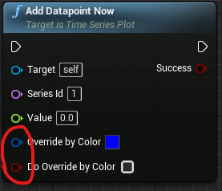

KantanCharts
-------------

#### Feature update: Per Point Color for Cartesian and Time Series Charts for UE 4.25+

This branch features a mod for KantanCharts that allows per-point color to be set in blueprints when adding the data point to the chart. What this gives you is the ability to do something like this (in the animation, every time the spacebar is pressed, the color changes from the default red color to blue; on the left there is an example of a time series chart with markers, on the right there is a cartesian plot drawn with line segments, both points and line segments work the same for both types of charts):

How is this useful? Well, think about cases when the color of a plot needs to be changed at runtime, at an arbitrary moment. For example, one can use it to display “safe” operating ranges of a certain variable.

Specific use cases include real-time control systems where UE4 serves as a kind of Supervisory, Control and Data Acquisition (SCADA) system and the color change might then signify an alarm state of an observed variable.

A demo of the implementation can be found in the plugin's `Content` folder. If run, it should produce a result identical to the demo presented above (minus the timing of the spacebar presses).

Specifically, the `Add Datapoint` and `Add Datapoint Now` blueprint functions have two additional inputs:

The `Override by Color` input expects a `FLinearColor` with the desired color. This will be used to override the default style. The `Do Override by Color` input expects a boolean that, for every sample, will determine whether the original color or the point or line segment should be overridden or not by the specified color. Hence, there is complete control over every point and every line segment which gives a lot of flexibility in drawing the plot.

#### Original author's note:

@NOTE: Due to changes specific to my personal build scripts, the 'develop' branch is now the one to use rather than 'master' if you want to work with this repository.
