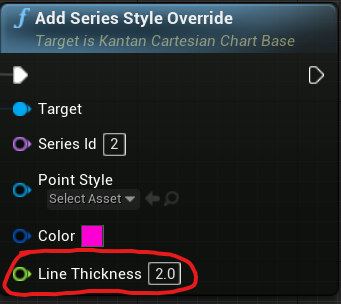

KantanCharts
-------------

This is a branch of the plugin that adds more features in terms of chart customization. It was decided to keep it as a separate branch and not merge it into release since it does change a few things in the internal architecture of the plugin, potentially adding a bit more overhead to memory used by the plugin.

The currently maintained features for UE4.25 and UE4.26 are:

* Per point overridable color for Cartesian and Time Series charts;
* Line thickness style can be configured per-series instead of per-chart (but not per point!)

Read about these features below where it is also explained how to set them up. Besides that, a simple demo map is included with the plugin that demonstrates the use of the new features.

#### Feature update: Per Point Color for Cartesian and Time Series Charts for UE 4.25+

The color of every point or line segment can be overridden by an `FLinearColor` specified by the user. 

What this gives you is the ability to do something like this:

In the animation, every time the spacebar is pressed, the color changes from the default red color to blue; on the left there is an example of a time series chart with markers, on the right there is a cartesian plot drawn with line segments.  Additionally, on the Cartesian chart the line thickness of the corresponding series has been set to 2.0.

How is this useful? Well, think about cases when the color of a plot needs to be changed at runtime, at an arbitrary moment. For example, one can use it to display “safe” operating ranges of a certain variable. Specific use cases that drove the development of this feature include real-time control systems where UE4 serves as a kind of Supervisory, Control and Data Acquisition (SCADA) system and the color change might then signify an alarm state of an observed variable.

A demo of the implementation can be found in the plugin's `Content` folder. If run, it should produce a result identical to the demo presented above (minus the timing of the spacebar presses).

Specifically, the `Add Datapoint` and `Add Datapoint Now` blueprint functions have two additional inputs:

The `Override by Color` input expects a `FLinearColor` with the desired color. This will be used to override the default style. The `Do Override by Color` input expects a `bool` that, for every sample, will determine whether the original color or the point or line segment should be overridden by the specified color. Hence, there is complete control over the color of every point and every line segment which gives a lot of flexibility in drawing the plot.

#### Feature update: Line Thickness for Series Style

Another useful feature is that series' line thickness is now accessible per-series instead of per-chart. This is of course only applicable to Cartesian and Time Series charts.

You can set line thickness with the corresponding `float` input in the `Add Series Style Override` function:

Remember that this will also override the default color (which, though, you typically want to do anyway).

